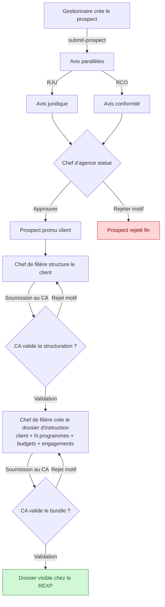
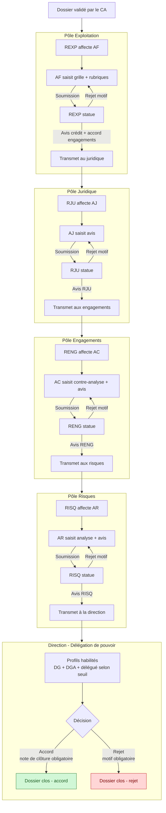
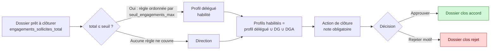

# ANGARA — Diagrammes Mermaid des workflows

> Référence métier : `prompt.txt` (lignes 110-227) — implémentation : voir `docs/WORKFLOW.md`.

Ce document contient trois diagrammes complémentaires :

1. **Workflow 1 — Entrée en relation** : prospect → client → structuration → dossier d'instruction.
2. **Workflow 2 — Instruction du dossier** : 5 pôles + clôture par délégation de pouvoir.
3. **Vue d'ensemble** : enchaînement des états macro et points de réouverture.

---

## 1. Workflow 1 — Entrée en relation

---

## 2. Workflow 2 — Instruction (5 pôles)

---

## 3. Vue d'ensemble — états et réouvertures

```mermaid
stateDiagram-v2
    [*] --> Prospect_brouillon: Gestionnaire
    Prospect_brouillon --> Avis_parallele: submit-prospect
    Avis_parallele --> Decision_CA: 2 avis saisis
    Decision_CA --> Prospect_rejete: Rejet
    Decision_CA --> Client_a_structurer: Approbation
    Prospect_rejete --> [*]
    Client_a_structurer --> Structuration_en_cours: CF
    Structuration_en_cours --> CA_decision_struct: Soumission
    CA_decision_struct --> Structuration_en_cours: Rejet
    CA_decision_struct --> Bundle_a_creer: Validation
    Bundle_a_creer --> Bundle_soumis: CF soumet
    Bundle_soumis --> Bundle_a_creer: Rejet CA
    Bundle_soumis --> Pole_Exploitation: Validation CA

    state "Pôle Exploitation" as Pole_Exploitation {
        [*] --> AF_saisie
        AF_saisie --> REXP_decision: Soumission
        REXP_decision --> AF_saisie: Rejet motif
        REXP_decision --> [*]: Transmission juridique
    }
    Pole_Exploitation --> Pole_Juridique

    state "Pôle Juridique" as Pole_Juridique {
        [*] --> AJ_saisie
        AJ_saisie --> RJU_decision: Soumission
        RJU_decision --> AJ_saisie: Rejet motif
        RJU_decision --> [*]: Transmission engagements
    }
    Pole_Juridique --> Pole_Engagements

    state "Pôle Engagements" as Pole_Engagements {
        [*] --> AC_saisie
        AC_saisie --> RENG_decision: Soumission
        RENG_decision --> AC_saisie: Rejet motif
        RENG_decision --> [*]: Transmission risques
    }
    Pole_Engagements --> Pole_Risques

    state "Pôle Risques" as Pole_Risques {
        [*] --> AR_saisie
        AR_saisie --> RISQ_decision: Soumission
        RISQ_decision --> AR_saisie: Rejet motif
        RISQ_decision --> [*]: Transmission direction
    }
    Pole_Risques --> Cloture_delegation

    Cloture_delegation --> Dossier_accord: Accord (note obligatoire)
    Cloture_delegation --> Dossier_rejet: Rejet (motif obligatoire)
    Dossier_accord --> [*]
    Dossier_rejet --> [*]
```

---

## 4. Délégation de pouvoir — règle de clôture

> Le DG et le DGA sont **toujours** habilités, en parallèle de tout profil délégué : ils gardent le pouvoir de clôture en dernier ressort. Implémentation : `InstructionDelegationService::authorizedProfilIdsForDossier()`.

---

## 5. Lecture des diagrammes

- **Flèches pleines** = transitions normales (soumission, validation, transmission).
- **Flèches « Rejet motif »** = retour à l'étape précédente avec motif obligatoire enregistré (date, heure, identité).
- **Soumission au maillon suivant** = verrouillage des modifications par l'acteur précédent.
- Les motifs et notes (rejet, clôture) sont **toujours obligatoires**, jamais en texte vide.
